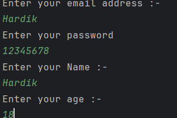
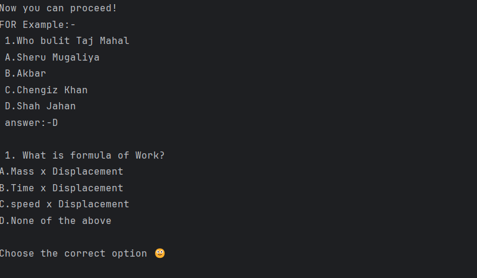
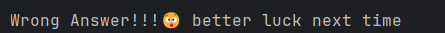
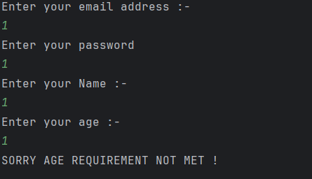

# I Am Smarticus! 🧠

An interactive quiz application that tests your knowledge across three exciting categories: Science, Maths, and Computer Applications. Challenge yourself, improve your scores, and earn a Certificate of Excellence!

## Overview

I Am Smarticus! is a console-based Java quiz game designed to make learning fun and engaging. Users can select from three different subject categories, answer multiple-choice questions, and receive instant feedback on their performance. The application includes a retry mechanism, allowing users up to 3 attempts to improve their scores and earn a certificate when they achieve 70% or higher.

## Features

- User authentication with email and password
- Age verification (minimum age: 13 years)
- Three quiz categories:
  - Science (Physics, Chemistry, Biology)
  - Maths (Arithmetic, Algebra)
  - Computer Applications (Java, OOP concepts)
- 5 multiple-choice questions per category
- Real-time scoring system
- Certificate of Excellence for scores above 70%
- Retry mechanism with up to 3 attempts per quiz
- Option to quit at any point during the quiz
- Interactive console interface with emojis

## Technologies/Tools Used

- Java (Core Java)
- Java Scanner class for user input
- Object-Oriented Programming (OOP) principles
  - Inheritance
  - Encapsulation
  - Method overriding
- BlueJ IDE (indicated by .ctxt and package.bluej files)

## Installation & Setup

### Prerequisites
- Java Development Kit (JDK) 8 or higher
- Any Java IDE (BlueJ, Eclipse, IntelliJ IDEA, or VS Code with Java extensions)
- Command line/terminal access

### Steps to Install & Run

1. Clone or download the project files to your local machine

2. Navigate to the project directory:
   ```cmd
   cd path\to\project
   ```

3. Compile all Java files:
   ```cmd
   cd src
   javac Main.java CA.java Maths.java Science.java userdata.java
   ```

4. Run the application:
   ```cmd
   java Main
   ```

### Alternative: Using BlueJ IDE

1. Open BlueJ IDE
2. Click on "Project" > "Open Project"
3. Navigate to the project folder and select it
4. Right-click on the "Main" class
5. Select "void main()" method
6. Click "OK" to run the application

## How to Use

1. Launch the application
2. Enter your email address and password
3. Provide your name and age (must be 13 or older)
4. Select a quiz category:
   - Press 1 for Science
   - Press 2 for Maths
   - Press 3 for Computer Applications
5. Answer each multiple-choice question by typing the letter (A, B, C, or D)
6. Press Enter to continue or type "quit" to exit
7. View your score and certificate (if you scored above 70%)
8. Choose to retry if you want to improve your score
9. Decide whether to play another quiz or exit

## Testing Instructions

### Manual Testing

1. Test user input validation:
   - Try entering age below 13 (should reject)
   - Try entering age 13 or above (should proceed)

2. Test quiz functionality:
   - Select each category (1, 2, 3) and verify questions load
   - Answer all questions correctly and verify score is 100%
   - Answer all questions incorrectly and verify score is 0%
   - Mix correct and incorrect answers

3. Test retry mechanism:
   - Score below 70% and choose to retry (type 'y')
   - Verify you get 2 additional attempts
   - Exhaust all attempts and verify the program exits

4. Test certificate generation:
   - Score above 70% and verify certificate displays with correct name, age, and score

5. Test quit functionality:
   - Type "quit" during quiz and verify program exits gracefully

6. Test invalid input:
   - Enter invalid category number (e.g., 5)
   - Verify error message displays

### Sample Test Cases

**Test Case 1: Successful Quiz Completion**
- Input: Valid email, password, name, age 15, category 1 (Science)
- Answer all questions correctly
- Expected: Score 100%, Certificate displayed

**Test Case 2: Retry Mechanism**
- Input: Valid credentials, category 2 (Maths)
- Answer 2 questions correctly (40%)
- Choose to retry ('y')
- Expected: Quiz restarts, attempts remaining shown

**Test Case 3: Age Restriction**
- Input: Valid email, password, name, age 10
- Expected: "SORRY AGE REQUIREMENT NOT MET!" message, program exits

## Project Structure

```
.
├── src/                    # Source code folder
│   ├── Main.java          # Entry point, handles category selection and game flow
│   ├── userdata.java      # Manages user registration and validation
│   ├── Science.java       # Science quiz questions and logic
│   ├── Maths.java         # Maths quiz questions and logic
│   └── CA.java            # Computer Applications quiz questions and logic
├── screenshots/           # Application screenshots
│   └── README.md         # Screenshot guidelines
├── README.md             # Project documentation
└── statement.md          # Project statement and scope
```

## Screenshots

### 1. Welcome Screen & User Registration

*User enters email, password, name, and age to begin the quiz*

### 2. Category Selection

*Main menu displaying three quiz categories: Science, Maths, and Computer Applications*

### 3. Science Quiz

*Example of Science quiz with multiple-choice questions*

### 4. Maths Quiz

*Example of Maths quiz with problem-solving questions*

### 5. Computer Applications Quiz

*Example of Computer Applications quiz testing Java and OOP concepts*

### 6. Correct Answer Feedback

*Positive feedback when user answers correctly with points awarded*

### 7. Wrong Answer Feedback

*Feedback when user answers incorrectly*

### 8. Score Display

*Final score showing points earned and percentage achieved*

### 9. Certificate of Excellence

*Certificate awarded for scores above 70% with user details*

### 10. Retry Mechanism

*Option to improve score with remaining attempts displayed*

### 11. Age Restriction

*Error message displayed when user is under 13 years old*

> Note: Add your actual screenshots to the `screenshots/` folder with the filenames shown above. See the [screenshots README](screenshots/README.md) for capture guidelines.

## Sample Output

```
Enter your email address :-
user@example.com
Enter your password
********
Enter your Name :-
John Doe
Enter your age :-
15

THANK YOU! YOU CAN PROCEED.
WELCOME TO Quiz:- 'I am Smarticus!😊'
*****Note:-The Certificate of excellance is rewarded when you score above 70%*****
Name :-John Doe
Age :-15

Please select the category from the following :-

1.Science
2.Maths
3.Computer Applications
Please Choose Number According To The Following Category
1
You Have Selected Science.
...
your points are :-40.0
your score is :-80.0

         C E R T I F I C A T E   O F   E X C E L L E N C E
         Name :-John Doe
         Age :-15
         Percentage :-80.0
```

## Future Enhancements

- Add more questions to each category
- Implement a question randomizer
- Add difficulty levels (Easy, Medium, Hard)
- Store high scores in a file or database
- Add timer for each question
- Create a graphical user interface (GUI)
- Add more subject categories

## Contributors

This project was developed as an educational quiz application to help students test their knowledge in various subjects.

---

WE ARE DELIGHTED THAT YOU PLAYED 'I AM SMARTICUS!', THANK YOU FOR USING OUR SERVICES! 🎉